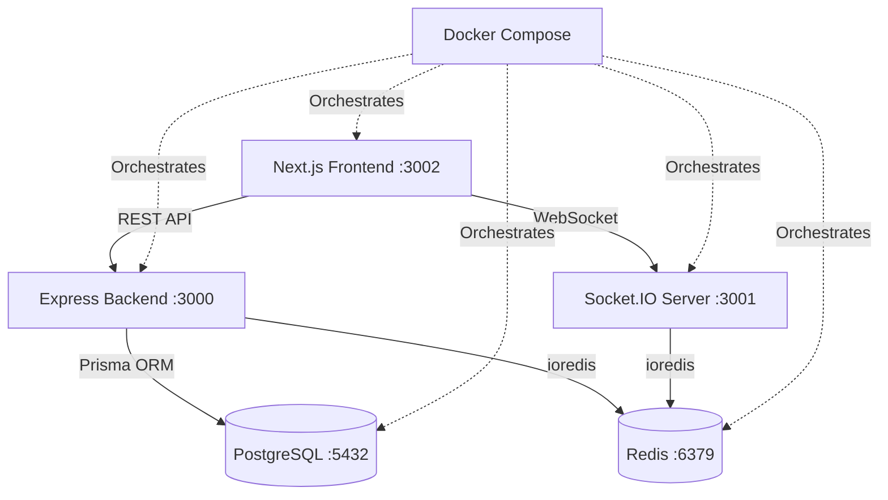

# Adaptive Student Learning Navigator

An intelligent full-stack platform for personalized learning with real-time cognitive load tracking, adaptive curriculum generation, and AI-powered intervention agents.

## Architecture Overview



## Technology Stack

### Frontend

- **Next.js 15** - React framework with App Router
- **TypeScript** - Type-safe development
- **TailwindCSS** - Utility-first styling
- **Socket.IO Client** - Real-time WebSocket communication
- **Zustand/Jotai** - Lightweight state management
- **React Hook Form + Zod** - Form handling and validation

### Backend

- **Node.js + Express** - REST API server
- **Socket.IO** - WebSocket server for real-time events
- **TypeScript** - Type-safe backend development
- **Prisma** - PostgreSQL ORM with migrations
- **ioredis** - Redis client with time-series support

### Databases

- **PostgreSQL 16** - Relational data (students, learning paths, metrics)
- **Redis Stack** - Time-series data (cognitive load) + caching

### DevOps

- **Docker Compose** - Multi-service orchestration
- **Nodemon** - Development hot-reload
- **Prisma Migrate** - Database migrations

## Prerequisites

- **Node.js 20+** - [Download](https://nodejs.org/)
- **Docker Desktop** - [Download](https://www.docker.com/products/docker-desktop/)
- **Git** - [Download](https://git-scm.com/)

## Installation

### 1. Clone the Repository

```bash
git clone <repository-url>
cd TP
```

### 2. Environment Variables

Copy the example environment file:

```bash
cp .env.example .env
```

Edit `.env` and update values as needed (default values work for local development).

### 3. Install Dependencies

#### Frontend

```bash
cd frontend
npm install
```

#### Backend

```bash
cd backend
npm install
```

## Running the Application

### Option 1: Docker Compose (Recommended)

Start all services with a single command:

```bash
docker-compose up -d
```

This will start:

- PostgreSQL (port 5432)
- Redis (port 6379, RedisInsight UI on 8001)
- Backend API (port 3000)
- WebSocket Server (port 3001)
- Frontend (port 3002)

### Option 2: Manual Setup

#### Start Databases

```bash
docker-compose up -d postgres redis
```

#### Run Database Migrations

```bash
cd backend
npx prisma migrate dev
npx prisma generate
```

#### Start Backend

```bash
cd backend
npm run dev
```

#### Start Frontend

```bash
cd frontend
npm run dev
```

## Accessing Services

| Service       | URL                              | Description                    |
| ------------- | -------------------------------- | ------------------------------ |
| Frontend      | http://localhost:3002            | Next.js application            |
| Backend API   | http://localhost:3000            | Express REST API               |
| WebSocket     | ws://localhost:3001              | Socket.IO server               |
| Health Check  | http://localhost:3000/api/health | Service status                 |
| PostgreSQL    | localhost:5432                   | Database (credentials in .env) |
| Redis         | localhost:6379                   | Cache & time-series data       |
| RedisInsight  | http://localhost:8001            | Redis GUI                      |
| Prisma Studio | Run `npm run prisma:studio`      | Database GUI                   |

## Project Structure

```
TP/
├── frontend/              # Next.js application
│   ├── src/
│   │   ├── app/          # Next.js 15 App Router
│   │   ├── components/   # Reusable UI components
│   │   ├── hooks/        # Custom React hooks
│   │   ├── lib/          # Utility functions
│   │   ├── services/     # API & WebSocket clients
│   │   ├── types/        # TypeScript definitions
│   │   └── context/      # React Context providers
│   ├── public/           # Static assets
│   └── package.json
│
├── backend/              # Node.js Express server
│   ├── src/
│   │   ├── server.ts           # Express entry point
│   │   ├── websocket/          # WebSocket server
│   │   ├── api/                # REST API routes
│   │   ├── models/             # Database models
│   │   ├── services/           # Business logic
│   │   ├── config/             # DB & Redis config
│   │   └── utils/              # Helper functions
│   ├── prisma/
│   │   └── schema.prisma       # Database schema
│   └── package.json
│
├── docker-compose.yml    # Multi-service orchestration
├── .gitignore
├── .env.example
└── README.md
```

## Database Schema

### Core Tables

- **students** - User accounts and profiles
- **learning_paths** - Personalized curriculum tracks
- **content_modules** - Lessons, quizzes, exercises
- **quiz_results** - Assessment outcomes
- **cognitive_metrics** - Real-time behavioral data
- **sessions** - User session tracking
- **path_history** - Curriculum modification audit trail

## Common Commands

### Database Management

```bash
# Run migrations
cd backend
npx prisma migrate dev --name <migration_name>

# Generate Prisma Client
npx prisma generate

# Open Prisma Studio
npx prisma studio

# Reset database (development only!)
npx prisma migrate reset
```

### Docker Commands

```bash
# Start all services
docker-compose up -d

# View logs
docker-compose logs -f

# View logs for specific service
docker-compose logs -f backend

# Stop all services
docker-compose down

# Rebuild services
docker-compose up -d --build

# Remove volumes (clears database data)
docker-compose down -v
```

### Development

```bash
# Backend development mode (with hot-reload)
cd backend
npm run dev

# Frontend development mode
cd frontend
npm run dev

# Build for production
npm run build
```

## Health Checks

Verify all services are running:

```bash
# Backend health check
curl http://localhost:3000/api/health

# PostgreSQL connection
docker-compose exec postgres psql -U postgres -d student_navigator -c "\dt"

# Redis connection
docker-compose exec redis redis-cli ping
```

## Troubleshooting

### Port Conflicts

If ports are already in use, modify the port mappings in `docker-compose.yml`:

```yaml
ports:
  - "<new-port>:<container-port>"
```

### Database Connection Issues

- Ensure PostgreSQL container is healthy: `docker-compose ps`
- Check logs: `docker-compose logs postgres`
- Verify `DATABASE_URL` in `.env`

### Redis Connection Issues

- Ensure Redis container is running: `docker-compose ps`
- Check logs: `docker-compose logs redis`
- Verify `REDIS_URL` in `.env`

### Frontend Can't Connect to Backend

- Verify `NEXT_PUBLIC_API_URL` and `NEXT_PUBLIC_WS_URL` in `frontend/.env.local`
- Check backend is running on port 3000
- Ensure CORS is configured correctly in backend

### Prisma Migration Errors

```bash
# Reset migrations (development only!)
cd backend
npx prisma migrate reset

# Re-run migrations
npx prisma migrate dev
```

## Development Workflow

1. **Start Services**: `docker-compose up -d`
2. **Make Changes**: Edit code in `frontend/` or `backend/`
3. **Hot Reload**: Changes auto-reload in development mode
4. **Database Changes**: Create migration with `npx prisma migrate dev`
5. **Test Changes**: Use health check endpoints and Prisma Studio
6. **Commit**: `git add .` → `git commit -m "description"`

## Future Phases

- **Phase 2**: Real-time Behavioral Tracking (mouse movements, scroll patterns, timing data)
- **Phase 3**: Cognitive Load Recognition Agent (Python + LangChain)
- **Phase 4**: Intervention Agent (adaptive notifications, pacing suggestions)
- **Phase 5**: Curriculum Agent (LangGraph for dynamic path generation)
- **Phase 6**: Retrieval Agent (RAG for personalized content)

## License

MIT

## Contributors

[Your Name]
